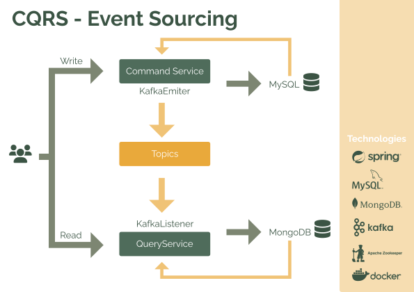

# CQRS pattern over Event Driven Architecture

### Technologies: 
- Apache Zookeeper 
- Apache Kafka
- Mysql 
- MongoDB
- Docker
- Docker compose
- Java 17
- Spring Boot
- Maven
- JUnit
- Cucumber


[](https://maven.apache.org/docs/3.8.1/release-notes.html)
[](https://docs.aws.amazon.com/corretto/latest/corretto-11-ug/downloads-list.html)
[](https://docs.spring.io/spring-boot/docs/2.7.6/)
[](https://github.com/p4pupro)
[](https://opensource.org/licenses/MIT)

The main propose of this project is test CQRS pattern over Event Sourcing Architecture (EDA). 
This project consists in two spring boot microservices (device-command, device-query), 
one to command and other to query operations. 
Additionally, to run all pieces of project it´s necessary deploy and run docker containers for two MySql and MongoDB databases, 
Apache Zookeeper and Apache Kafka message broker.

In the next diagram you can look how this project was designed:



## Requirements 📋
To run this project you need install next requirements:
- [jdk17](https://docs.aws.amazon.com/corretto/latest/corretto-17-ug/downloads-list.html)
- [maven](https://maven.apache.org/docs/3.8.1/release-notes.html)
- [docker](https://www.docker.com/) and [docker-compose](https://docs.docker.com/compose/)

## Installation 🔧
To generate jar files run the following command in root path:

```bash
mvn clean package
```

## Run in containers 🐳
Run containers of *Zookeeper, Apache Kafka, MySql, MongoDB, Device-command, Device-query*.

```bash
docker-compose up -d
```

If you prefer you can stop containers for device-command and query-command then you can launch the Spring Boot microservices with the followings instructions:

### Microservice device-command 🚀
Run in terminal the following command:

```bash
java -jar device-command/target/device-command-0.0.1-SNAPSHOT.jar.original
```

### Microservice device-query 🚀
In other terminal run the following command:

```bash
java -jar device-query/target/device-query-0.0.1-SNAPSHOT.jar.original
```

### OpenAPI definition 
[device-command](http://localhost:8081/v3/api-docs/) 

[device-query](http://localhost:8082/v3/api-docs/)


### Swagger UI
[device-command](http://localhost:8081/swagger-ui/index.html)

[device-command](http://localhost:8082/swagger-ui/index.html)


# Running manual test ⚙️
Once all microservice started you can test this service using the postman collection. 
with name *tfg-postman-collection.json* in resources folder:


# Running unit test 🧪
Then in terminal run:
```bash
mvn test
```

# Running performance test 🎯
Previously do you need run the system:
```bash
docker-compose up -d
```
Then in terminal over performance-test path run:
```bash
mvn jmeter:jmeter
```

# Running integration test 🔒
Previously do you need run the system:
```bash
docker-compose up -d
```
Then in terminal over device-command / device-query path run:
```bash
mvn clean verify -Dskip.integration.tests=false
```

